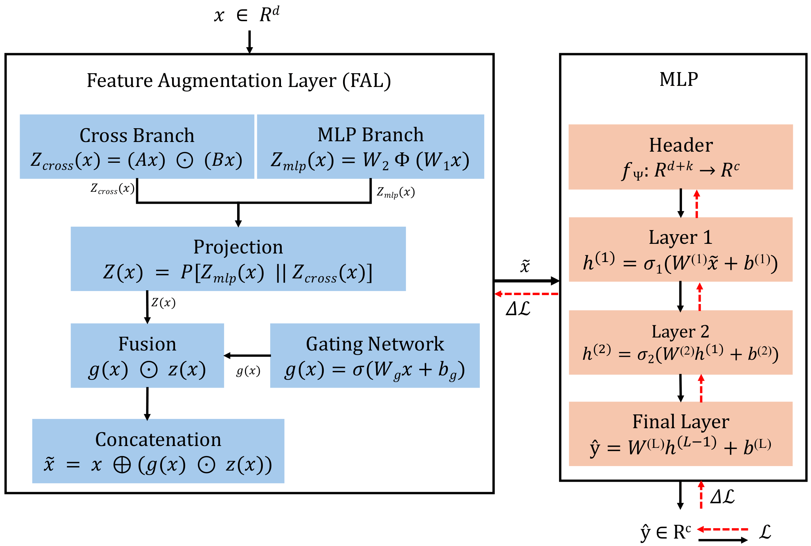

# AugTab: Learnable Feature Augmentation for Low-Dimensional Tabular Data (ECML PKDD 2026 Research Track)


[](https://doi.org/10.1007/978-3-032-37670-1_24)


<p align="center">
  
</p>

Anonymous code repository for submission to **ECML-PKDD 2026**  
**European Conference on Machine Learning and Principles and Practice of Knowledge Discovery in Databases 2026**  
**Paper ID / PID: 416**

## Overview

This repository contains the implementation of **AugTab**, a framework for **learnable feature augmentation** in low-dimensional tabular data. AugTab is designed to improve predictive performance by learning augmented representations jointly with the downstream backbone in an end-to-end manner.

This anonymous repository is provided for the review process and currently includes:

- `AugTab.py` — core implementation of the AugTab model
- `AugTab Try.ipynb` — example notebook demonstrating how to use AugTab with **Optuna-based hyperparameter tuning** and **5-fold cross-validation**, reporting **mean accuracy ± standard deviation** on the **Water Potability** dataset

The notebook is written so that the dataset file and target column can be changed easily, allowing the same workflow to be reused for other tabular datasets.

In addition, the notebook includes supplementary diagnostic and analysis code used to further inspect AugTab’s behavior.

---

## Repository Contents

```text
.
├── AugTab.py
├── AugTab Try.ipynb
├── requirements.txt
└── README.md
